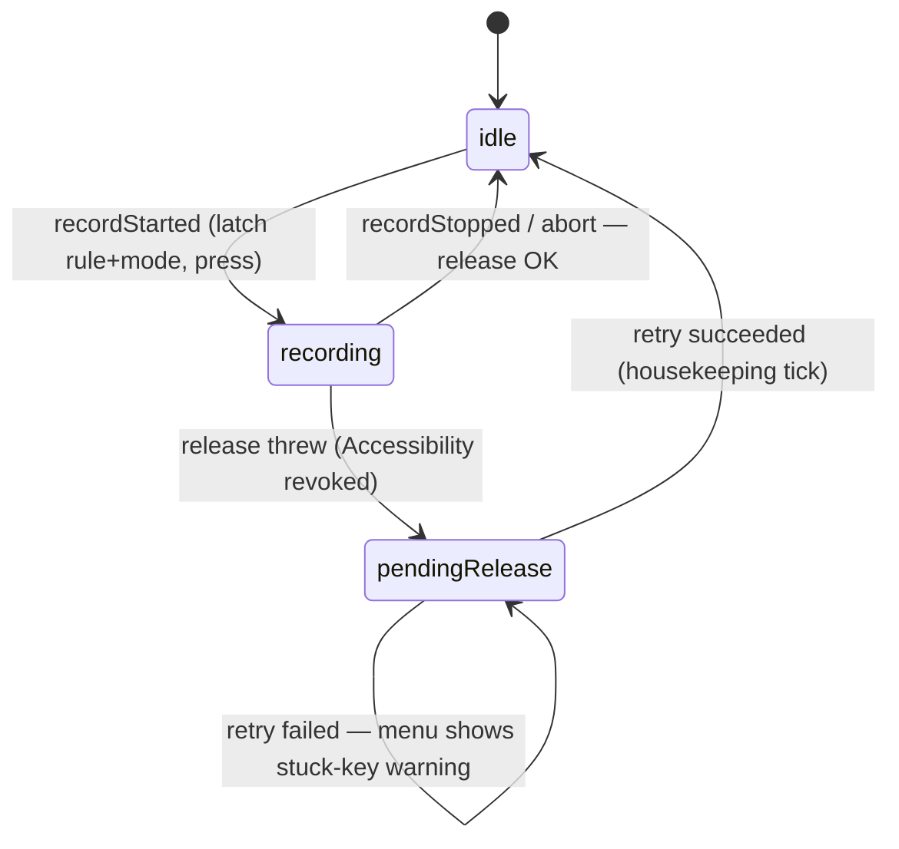

# fix: Make hold mode safe, harden config reload, and unblock publication

## Overview

A 12-reviewer code review of the whole repo found one P0 and eight P1s standing
between Ramble and its first public release. This plan fixes them, plus the P2s
that sit in the same files and would otherwise need a second pass.

Three of the findings are the same failure wearing different hats: **a held
modifier key that never comes back up.** For a tool whose whole job is holding
Fn down while you talk, a stuck modifier is the worst thing it can do — the
keyboard is unusable until the user finds and force-quits a menu bar app they
may have hidden. That failure class is the spine of this plan.

## Problem Frame

Ramble presses a key when you press the mic button and releases it when you
press again. `TriggerMachine` stores what it pressed in
`.recording(rule:held:since:)` — but the stop path never reads it back. It
re-derives a chord from `rule.onStop` instead and releases *that*. Three
consequences, all verified against the source:

1. A hold rule with no `onStop` releases nothing. `perform` returns
   `.nothingConfigured` before reaching any release, and `state` is already
   `.idle`, so `abort()` and the 300s `checkTimeout()` both answer "nothing to
   abort." The key is down forever.
2. A hold rule whose `onStop` differs from `onStart` releases the wrong key and
   strands the right one.
3. `mode` is read live at fire time, so editing the config mid-take can pair a
   hold-press with a tap-stop — same outcome.

Meanwhile `abort()`, the function whose doc comment promises to be "the
difference between a dropped connection being an inconvenience and it wedging
the keyboard," clears `state` *before* confirming `keystroke.release()`
succeeded. `Keystroke.isTrusted` can flip false mid-session when Accessibility
is revoked; when it does, the chord is gone and nothing retries.

Separately, the release pipeline cannot ship a verified artifact
(`sha256 :no_check` against a sed that only matches a quoted value), the repo
has no LICENSE, and the README claims a CI that does not exist.

## Requirements Trace

- R1. A hold-mode take always releases exactly the chord it pressed, regardless
  of what `onStop` says or whether it is present at all.
- R2. The mode in force for a take is fixed when the take starts and cannot
  change under it.
- R3. A failed release is retried rather than forgotten, and is visible to the
  user while it is outstanding.
- R4. Toggle is the documented default for any rule that does not ask for hold;
  hold is explicit opt-in.
- R5. Hardware duplicate button events never count toward the runaway limit.
- R6. A malformed config never causes Ramble to overwrite the user's file, and
  never silently changes which rules fire.
- R7. A malformed config produces an error naming the offending key.
- R8. `Config.save()` preserves keys it does not model.
- R9. Every released artifact carries a real checksum that Homebrew verifies.
- R10. The repo carries a LICENSE and a CI workflow that actually runs the suite.
- R11. Config load/save/reload paths carry regression coverage.
- R12. Nothing published leaks the author's hardware identifiers, and the doc
  set matches the shipped code.

## Scope Boundaries

- Not adding a Developer ID or notarization. Ad-hoc signing and its re-grant
  caveat stay as documented; that is a $99/yr decision, not a code fix.
- Not restructuring the four CLI tools' argument parsing. `cli-readiness` raised
  real ergonomics gaps, but they are P2/P3 and independent of publication.
- Not converting `ramble-check` to a test framework. No Xcode, by constraint.
- Not adding a config schema version field. Additive-with-defaults decoding plus
  unknown-key preservation (R8) covers the realistic evolution path; a version
  field can come when a genuinely breaking change needs one.

### Deferred to Separate Tasks

- Per-frame menu rebuild and 5s unconditional rebuild (performance P2): real,
  but touches the menu lifecycle broadly. Separate change.
- `EventLog` persistent file handle and rotation tests (P2/P3): separate change.
- `BLEClient` connect timeout (P2): separate change.

## Context & Research

Research came from the 12-reviewer pass completed immediately before this plan
(`.context/compound-engineering/ce-review/20260817-231131-3f5a2291/`). A
`learnings-researcher` run during that pass confirmed there is no
`docs/solutions/` in this repo or in any of 36 sibling repos, so there are no
institutional learnings to carry forward. No external research: the design
question here (toggle vs hold defaults) is already answered by the repo's own
hardware findings.

### Relevant Code and Patterns

- `Sources/RambleCore/TriggerMachine.swift` — `State.recording(rule:held:since:)`
  already carries the held chord. The fix reads it back rather than adding
  new state plumbing.
- `Sources/RambleCore/Config.swift` — `TriggerMode` already documents `toggle`
  as "the natural fit and the default" and `hold` as "riskier: ... a crash
  mid-hold leaves a stuck key." R4 makes the code match its own comment.
- `Sources/Ramble/AppDelegate.swift` — the 5s housekeeping timer that drives
  `checkTimeout()` is the natural retry tick for R3.
- `Sources/ramble-check/main.swift` — `group(...)` / `expectEqual(...)` harness
  and the `FakeKeystroke` double. All new coverage follows this shape.

### Institutional Learnings

- None available. `docs/solutions/` does not exist in this repo or any sibling.
- Worth noting for later: `README.md` cites `aerospace-swipe-intercept` as
  precedent for the ad-hoc-signing caveat, and that repo is not on this machine.
  Verify the claim before it ships publicly (folded into Unit 7).

## Key Technical Decisions

- **In hold mode, `onStop` no longer determines what is released.** The release
  target is the chord recorded in state at press time. `onStop` becomes
  meaningless for hold rules rather than load-bearing. This deletes the failure
  class outright instead of validating against it — a config that omits or
  mismatches `onStop` simply cannot strand a key any more.

- **Latch the resolved mode into the take, not just the rule.** `State.recording`
  gains the resolved `TriggerMode`. The rule is already latched at take start
  (documented behavior: begin in the terminal, switch apps, stop still goes to
  the terminal's rule). Latching the mode is the same principle applied to the
  thing that decides press-vs-tap.

- **Toggle is the default; hold is opt-in.** Already true in code
  (`Config.mode = .toggle`, `rule.mode ?? config.mode`) but undocumented as a
  safety property and untested. Make it explicit in `README.md` and cover it.
  The starter config's Wispr Flow target **keeps** `mode: .hold` — its Fn
  push-to-talk is hardware-verified in `FINDINGS.md` and is the primary
  documented use case; now that hold is structurally safe, the reason to avoid
  it is gone. Hold stays the exception, declared per rule, never inherited by
  accident.

- **On a failed reload, keep the last known good config — do not fall back to
  starter.** Reviewers split on this. Keep-last-known-good wins because the
  machine *already* behaves that way (it keeps firing the last good rules, which
  is what a user with a typo in their JSON wants), and because the alternative
  is what causes the data loss: `self.config` becomes starter while
  `machine.config` stays good, and the next `selectTarget` saves starter over
  the user's file. Syncing the machine forward to starter would instead silently
  change which keys fire on a typo — strictly worse. `Config.starter()` is used
  only when there is no good config yet, which is its actual purpose.

- **Never write a config file we could not read.** Independent of the above:
  gate `save()` behind a flag that is only set by a successful load. Belt and
  braces, because the failure mode is destroying a user's hand-written file.

- **Seed the cask with a placeholder checksum string, not `:no_check`.** Keeps
  `release.sh`'s existing sed strategy and makes an un-run release script fail
  loudly at `brew install` rather than silently accepting any artifact.

## Open Questions

### Resolved During Planning

- *Should hold mode be removed entirely, given it causes all three stuck-key
  paths?* No. Wispr Flow's Fn push-to-talk genuinely requires it and is the
  primary use case. Make it safe instead.
- *Should the starter config switch Wispr Flow to toggle?* No — see decisions.
  The user's "tap as the per-app default" direction is honored by making toggle
  the default for everything that does not explicitly ask for hold.
- *Sync machine forward, or keep last known good, on parse failure?* Keep last
  known good — see decisions.

### Deferred to Implementation

- Exact retry cadence and menu wording for an outstanding stuck-key release.
  The 5s housekeeping tick is the obvious hook; whether one retry or repeated
  retries reads better depends on how the warning looks in the menu.
- Whether unknown-key preservation is cleanest as an extras bucket on `Config`
  or a merge at the JSON-object layer. Both satisfy R8; pick when touching the
  encoder.

## High-Level Technical Design

> *This illustrates the intended approach and is directional guidance for
> review, not implementation specification. The implementing agent should treat
> it as context, not code to reproduce.*

The state change that carries most of the plan:

    // before — mode and release target both re-derived at stop time
    case recording(rule: Rule, held: KeyChord?, since: Date)

    // after — everything the stop path needs is fixed at start time
    case recording(rule: Rule, mode: TriggerMode, held: KeyChord?, since: Date)

Stop-path decision, stated as a table:

| mode (latched) | held chord | `onStop` | what stop does |
|---|---|---|---|
| hold | present | anything, incl. absent | release the **held** chord |
| hold | none (press failed) | anything | nothing to release; report it |
| toggle | n/a | present | tap `onStop` |
| toggle | n/a | absent | nothing configured |

Release-failure lifecycle:

The point of `pendingRelease` is that the chord survives the failure. Today it
is discarded at the moment it becomes most important.

## Implementation Units

- [x] **Unit 1: Release what was actually held, and latch the mode**

**Goal:** Kill the P0 and the mode-race P1 with one state change.

**Requirements:** R1, R2, R4

**Dependencies:** None

**Files:**
- Modify: `Sources/RambleCore/TriggerMachine.swift`
- Test: `Sources/ramble-check/main.swift`

**Approach:**
- Add the resolved `TriggerMode` to `State.recording`, resolved once at
  `.recordStarted` from `rule.mode ?? config.mode`.
- `.recordStopped` binds `held` instead of discarding it, and passes both the
  latched mode and the held chord into `perform`.
- In `perform`, the `(.hold, .stop)` branch releases the **held chord** and
  never consults `action.chord()`. Reorder so the `guard let action` early
  return cannot preempt a pending release — a hold stop with no `onStop` must
  still release.
- A hold stop where `held` is nil (the press itself failed) reports a distinct
  outcome rather than pretending it fired.

**Execution note:** Write the missing-`onStop` regression test first — it is the
P0 and it must fail before the change.

**Patterns to follow:** existing `perform` switch on `(mode, phase)`;
`FakeKeystroke` in `Sources/ramble-check/main.swift`.

**Test scenarios:**
- Happy path: hold rule, `onStart` fn, `onStop` fn — press on start, release fn
  on stop. (Existing behavior must not regress.)
- Error path: hold rule, `onStart` fn, **`onStop` absent** — stop still releases
  fn. Fails before this unit.
- Error path: hold rule, `onStart` fn, `onStop` **space** — stop releases fn,
  never space.
- Error path: hold rule whose `onStart` chord failed to parse, so nothing was
  held — stop reports nothing-held and does not throw.
- Edge case: `config.mode` flipped from `.hold` to `.toggle` between a take's
  start and its stop — the take still releases as a hold.
- Edge case: `rule.mode` nil and `config.mode` toggle — taps on both edges, key
  never held.
- Happy path: a rule with no `mode` set resolves to toggle (R4 made explicit).

**Verification:** A hold take releases the pressed chord in every combination of
present/absent/mismatched `onStop`, and no config edit mid-take changes how the
take ends.

---

- [x] **Unit 2: Never lose a held chord on a failed release**

**Goal:** `abort()` keeps its promise even when `keystroke.release()` throws.

**Requirements:** R3

**Dependencies:** Unit 1

**Files:**
- Modify: `Sources/RambleCore/TriggerMachine.swift`
- Modify: `Sources/Ramble/AppDelegate.swift`
- Test: `Sources/ramble-check/main.swift`

**Approach:**
- Attempt the release **before** clearing state. Only clear on success.
- On failure, retain the chord as a pending release and expose it (a
  `pendingRelease` property or equivalent) so the app can both retry and warn.
- Retry from the existing 5s housekeeping tick that already drives
  `checkTimeout()`; clear on success.
- Surface an outstanding pending release in the menu, alongside the existing
  Accessibility warning — the two share a root cause.
- `FakeKeystroke` needs a throw-on-demand switch; it currently cannot fail,
  which is why this path has no coverage.

**Test scenarios:**
- Error path: release throws during `abort()` — the chord is retained, not lost.
- Happy path: a later retry succeeds — pending clears, state returns to idle.
- Error path: retry throws again — still pending, still reported.
- Error path: release throws during a normal `.recordStopped` — same retention.
- Edge case: `abort()` with nothing held — no pending release created.
- Integration: with a pending release outstanding, the menu reports a stuck key.

**Verification:** No sequence of release failures leaves the machine believing
nothing is held while a key is physically down.

---

- [x] **Unit 3: Count real starts, not hardware duplicates**

**Goal:** Stop the runaway guard tripping during normal rapid dictation.

**Requirements:** R5

**Dependencies:** None

**Files:**
- Modify: `Sources/RambleCore/TriggerMachine.swift`
- Test: `Sources/ramble-check/main.swift`

**Approach:** `recentStarts.append(now)` currently runs before the
duplicate-window check further down, so one physical press counted twice halves
the effective budget from 12/60s to ~6 real takes per minute. Move the append
(and the limit evaluation) after the duplicate determination so only starts that
are actually acted on count.

**Test scenarios:**
- Edge case: 12 starts each immediately followed by a duplicate inside
  `duplicateWindow` — guard does not trip. Fails before this unit.
- Happy path: 13 genuine starts inside `runawayWindow` — guard still trips.
- Edge case: with `duplicateWindow` at its real default (not 0, as the current
  test sets it) the guard tolerates a duplicate per press.
- Happy path: `reset()` clears the counter and the tripped flag.

**Verification:** Duplicate-heavy hardware cannot pause firing; a genuinely
runaway button still can.

---

- [x] **Unit 4: A bad config never costs the user their config**

**Goal:** Fix the divergence, the overwrite, the opaque error, and the silent
key-dropping — all in the load/save path.

**Requirements:** R6, R7, R8, R11

**Dependencies:** None

**Files:**
- Modify: `Sources/Ramble/AppDelegate.swift`
- Modify: `Sources/RambleCore/Config.swift`
- Test: `Sources/ramble-check/main.swift`

**Approach:**
- In `loadConfig`'s catch: if a good config already exists, keep it — for
  `self.config` and `machine.config` alike. Only use `Config.starter()` when
  there is no good config yet.
- Track whether the in-memory config came from a successful load, and refuse to
  `save()` when it did not. `selectTarget` and `hideMenuBarIcon` both call
  `save()` and are the paths that destroy the file today.
- Report `DecodingError` by `codingPath` and `debugDescription` rather than
  `error.localizedDescription`, which is a generic Foundation string naming
  nothing.
- Write config load failures to `EventLog` — currently a parse failure leaves no
  durable trace at all, so a script cannot tell whether its write took effect.
- Preserve unknown top-level keys across `save()`.

**Execution note:** `Config.load/save/loadOrCreate` have no coverage at all
today. Add characterization tests against temp files for current good-path
behavior before changing the error path.

**Test scenarios:**
- Happy path: `load` → `save` → `load` round-trips a full config unchanged.
- Happy path: `loadOrCreate` on a missing file writes starter and reports created.
- Error path: malformed JSON with a good config already loaded — rules keep
  firing from the good config, and the menu still shows it.
- Error path: malformed JSON on **first** load — starter is used.
- Error path: after a failed reload, `selectTarget` does **not** write to disk.
  This is the data-loss regression.
- Error path: wrong type for a known key (e.g. `mode: 5`) — the error names
  `mode`.
- Edge case: a config with an unknown top-level key survives a save/load cycle
  with the key intact.
- Edge case: empty file, and a file containing `{}`.
- Integration: a parse failure appears in `EventLog`.

**Verification:** No config file the user wrote is ever replaced by one Ramble
invented, and every parse failure says which key was wrong.

---

- [x] **Unit 5: Ship a verifiable artifact**

**Goal:** Make Homebrew actually check what it downloads.

**Requirements:** R9

**Dependencies:** None

**Files:**
- Modify: `Casks/ramble.rb`
- Modify: `Scripts/release.sh`

**Approach:**
- Replace `sha256 :no_check` with a quoted placeholder so `release.sh`'s
  existing sed pattern matches and rewrites it. An un-run release script then
  fails loudly at install time instead of accepting any bytes.
- Have `release.sh` verify the substitution actually happened and exit non-zero
  if the cask still holds the placeholder — the failure mode this whole unit
  exists to prevent should not be able to recur silently.
- Validate the version argument against a semver-ish pattern before it is
  written into the cask or used as a release tag.
- Reject an unrecognized second argument rather than silently not publishing.

**Test scenarios:** *(shell, verified by running the script — no ramble-check
coverage, since it does not exercise `Scripts/`)*
- Happy path: `release.sh 0.1.0` rewrites both `version` and `sha256`, and the
  written sha matches `shasum -a 256` of the zip.
- Error path: a cask still holding the placeholder after the sed fails the run.
- Error path: `release.sh 1.2.3.4` / `release.sh vX` is rejected.
- Error path: `release.sh 0.1.0 --publsh` is rejected, not silently ignored.

**Verification:** A release cannot reach the tap without a real checksum.

---

- [x] **Unit 6: LICENSE and CI**

**Goal:** Make the repo legally usable and the README's CI claim true.

**Requirements:** R10

**Dependencies:** None

**Files:**
- Create: `LICENSE`
- Create: `.github/workflows/ci.yml`
- Modify: `README.md`

**Approach:**
- MIT, attributed to the repo author — permissive, matches the "take this and
  use it" tone of the docs. Without a license the code is all-rights-reserved
  and no one may legally use or contribute to it.
- CI on `macos-latest`: `swift build` then `swift run ramble-check`, on push and
  PR. The suite already exits non-zero on failure, which is exactly what the
  README says makes it CI-ready.
- Add a build/CI badge and make sure the README's claim matches what runs.

**Test expectation:** none — configuration and licensing carry no behavior. The
workflow proves itself by running.

**Verification:** CI is green on a push, and the repo states its license.

---

- [x] **Unit 7: Honest failures, dead code, and publication hygiene**

**Goal:** The P2/P3 cleanup that lives in files this plan already touches.

**Requirements:** R12, plus review P2s

**Dependencies:** Units 1–4

**Files:**
- Modify: `Sources/RambleCore/TriggerMachine.swift`
- Modify: `Sources/Ramble/AppDelegate.swift`
- Modify: `captures/mode-bluetooth-mic.log`
- Modify: `README.md`, `VERIFY.md`, `PLAN.md`
- Delete or supersede: `instamic-ble-trigger-handoff.md`
- Test: `Sources/ramble-check/main.swift`

**Approach:**
- Propagate `Process.run()` failure out of the shell-action path so `perform`
  can return `.failed`; today `try?` swallows it and always reports `.fired`.
- Abort an in-flight take on BLE `.poweredOff` / `.unauthorized` /
  `.unsupported`, not only `.disconnected`. Right now only the 300s timeout
  recovers those, and with Unit 1 in place the abort correctly lifts the key.
- Delete `adoptDeviceState` — never called, and its `recording` parameter is
  discarded unused. Its stated purpose is served by `abort(reason:)` on connect.
- Redact the device MAC in `captures/mode-bluetooth-mic.log`. Leave the rotating
  private address in the handoff doc alone; it is documented as rotating.
- Retire `instamic-ble-trigger-handoff.md`: it opens with "no code written yet"
  and is not in the README's doc index. Fold anything unique into `PROTOCOL.md`
  or `FINDINGS.md`, then delete it.
- Update `README.md` for the new hold semantics (`onStop` is not required for
  hold rules; toggle is the default) and flag `PLAN.md` §3/§4 as historical —
  they describe a `RuleEngine.swift` and a `defaultAction` key that never shipped.
- Verify or drop the `aerospace-swipe-intercept` reference in `README.md`.

**Test scenarios:**
- Error path: a shell action that cannot launch reports `.failed`, not `.fired`.
- Happy path: a shell action that launches reports `.fired`.
- Integration: BLE `.poweredOff` mid-take aborts and releases the held key.
- Edge case: BLE `.poweredOff` with no take in progress is a no-op.

**Verification:** `grep` finds no unredacted MAC; every doc claim matches the
code; no dead code remains in `TriggerMachine`.

## System-Wide Impact

- **Interaction graph:** `State.recording` gains a case parameter — every
  `case .recording` binding in `TriggerMachine` must be revisited. The compiler
  finds them all, which is the reason to change the enum rather than add a
  parallel variable.
- **Error propagation:** two paths change from silent to reported (shell launch
  failure, config parse failure). Both currently return success-shaped outcomes;
  callers that pattern-match on `.fired` will now see `.failed`.
- **State lifecycle risks:** the new pending-release state must not leak across
  a `reset()` or a config reload — it represents a physical key, not a
  configuration.
- **API surface parity:** `RambleCore` is a library product, so `State`,
  `TriggerOutcome`, and any new public property are exported. Keep additions
  non-public unless they need to cross the target boundary.
- **Unchanged invariants:** the rule is still latched at take start; the
  Instamic wire protocol, `Frame` parsing, and the BLE client's reconnect
  behavior are untouched. Config remains backward-compatible — every field
  decodes with a default, and after Unit 4 unknown keys survive a round trip.

## Risks & Dependencies

| Risk | Mitigation |
|------|------------|
| Changing what hold-stop releases could break a working Wispr Flow setup | For the documented config (`onStart` == `onStop`) behavior is identical; the existing hold tests cover it and must stay green |
| Refusing to save while the config is unparsed could strand a user whose file is broken — menu changes appear not to persist | The menu already surfaces the parse error; Unit 4 also logs it. Fixing the file restores saving on the next successful reload |
| A pending-release retry could fire a release into whatever app is now frontmost | Release targets a chord, not an app; a modifier-up event to the wrong app is inert, whereas leaving it down is not |
| MIT may not be the author's intent | Stated as a decision here; trivially swapped before merge |
| Redacting a committed capture rewrites recorded evidence | Redact in place with an explicit `[redacted]` marker so the log stays readable as evidence |

## Documentation / Operational Notes

- `README.md`: hold no longer requires `onStop`; toggle is the default; add the
  CI badge; confirm or drop the `aerospace-swipe-intercept` claim.
- `VERIFY.md`: the check count reference was already corrected during review;
  re-check it after new tests land.
- `PLAN.md`: mark §3/§4 historical.
- No migration needed — every config valid today stays valid.

## Sources & References

- Review artifacts: `.context/compound-engineering/ce-review/20260817-231131-3f5a2291/`
- Related code: `Sources/RambleCore/TriggerMachine.swift`,
  `Sources/RambleCore/Config.swift`, `Sources/Ramble/AppDelegate.swift`,
  `Casks/ramble.rb`, `Scripts/release.sh`
